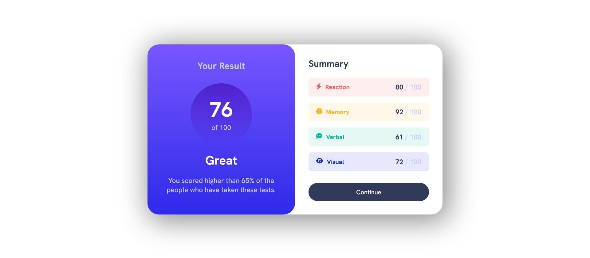

# Frontend Mentor - Results summary component solution

This is a solution to the [Results summary component challenge on Frontend Mentor](https://www.frontendmentor.io/challenges/results-summary-component-CE_K6s0maV). Frontend Mentor challenges help you improve your coding skills by building realistic projects. 

## Table of contents

- [Overview](#overview)
  - [The challenge](#the-challenge)
  - [Screenshot](#screenshot)
  - [Links](#links)
- [My process](#my-process)
  - [Built with](#built-with)
  - [What I learned](#what-i-learned)
  - [Useful resources](#useful-resources)
- [Author](#author)
- [Acknowledgments](#acknowledgments)

## Overview

### The challenge

Users should be able to:

- View the optimal layout for the interface depending on their device's screen size
- See hover and focus states for all interactive elements on the page

### Screenshot

### Links

- Solution URL: [Add solution URL here](https://your-solution-url.com)
- Live Site URL: [Add live site URL here](https://your-live-site-url.com)

## My process

### Built with

- Semantic HTML5 markup
- CSS custom properties
- Flexbox
- Mobile-first workflow

### What I learned

I learnt how to set css units for responsive design and also learnt how to use flexbox to achieve complex layouts

### Useful resources

- [Resource 1](https://cssgenerator.org) - This helped me for setting a custom box shadow. I really liked resource and will use it going forward.
- [Resource 2](https://www.freecodecamp.org/news/override-root-font-size-for-a-better-user-experience/) - This is an amazing article which helped me finally understand how to use css units for responsive pages. I'd recommend it to anyone still learning this concept.

## Author

- Website - [The Cyberverse](https://www.your-site.com)
- Frontend Mentor - [@CyberVerse2](https://www.frontendmentor.io/profile/CyberVerse2)
- Twitter - [@TheCyberVerse1](https://www.twitter.com/TheCyberVerse1)

## Acknowledgments

My thanks goes to the creator of Frontend Mentor, his own version on github helped me know how to make the shadow effect on the score circle."# result-summary-componenet" 
